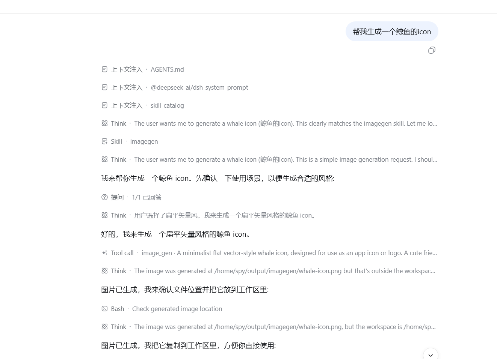
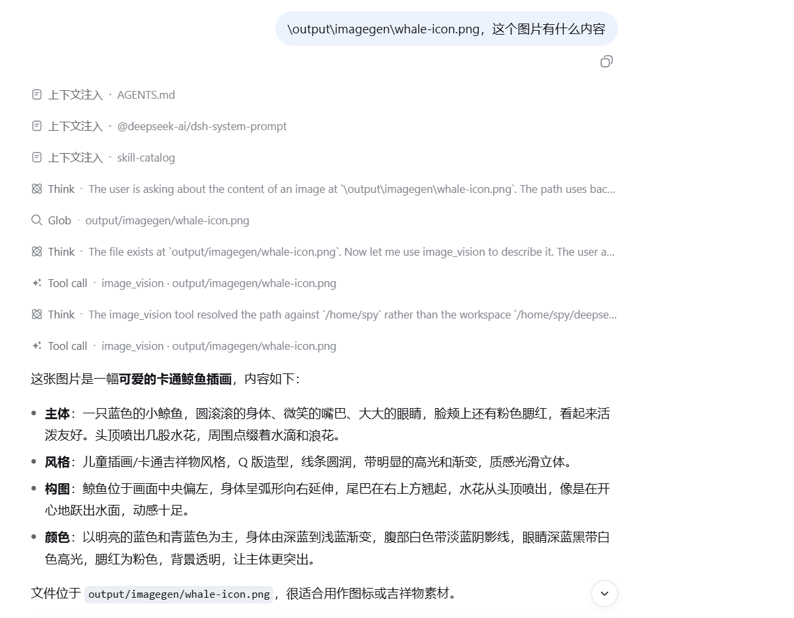

# dsh-imagegen

[中文](./README.zh-CN.md)

**Image generation and image understanding for the DeepSeek Harness — powered by your ChatGPT subscription. No `OPENAI_API_KEY` needed.**

A DeepSeek Harness plugin that registers two model tools:

| Tool | What it does |
| --- | --- |
| `image_gen` | Generates a bitmap image (illustrations, icons, logos, photos, concept art, UI mockups) through the ChatGPT Codex backend. |
| `image_vision` | Describes or answers questions about an image with a multimodal model — giving text-only harness models (e.g. `deepseek-v4-flash`) plug-in vision. |

Both tools reuse the **ChatGPT login state** (the same OAuth tokens the official Codex CLI uses) and the harness-owned transports in [`scripts/`](./scripts) — zero npm dependencies, Node built-in `https` only.

## How it works

```
image_gen / image_vision (model tool)
        │  harness.registerTool + credentials service
        ▼
index.js (Cordis bundle entry)
        │  shell service, env-only argument passing
        ▼
scripts/codex-imagegen.mjs / codex-vision.mjs   ← harness-owned transports
        │  OAuth refresh (auth.openai.com) + POST chatgpt.com/backend-api/codex/responses
        ▼
        gpt-5.5 (multimodal) → PNG file / text description
```

Auth precedence (both transports): `CODEX_ACCESS_TOKEN` / `CODEX_REFRESH_TOKEN` / `CODEX_ACCOUNT_ID` environment variables (resolved from the DSH credentials service, keys `OPENAI_CODEX_API_KEY` / `OPENAI_CODEX_REFRESH_TOKEN`) → `~/.codex/auth.json` (`codex login`). On HTTP 401 the transport refreshes the access token once and persists it back to `~/.codex/auth.json` (atomic, 0600).

## Requirements

- DeepSeek Harness (the plugin is a preset-local Cordis plugin; tested against current builds)
- Node.js ≥ 22 (for the transports)
- A ChatGPT subscription login state:
  - `~/.codex/auth.json` from `codex login` (recommended), **or**
  - the `OPENAI_CODEX_API_KEY` / `OPENAI_CODEX_REFRESH_TOKEN` credentials in DSH

## Install

The package ships as a **bundle**: installing it into a profile registers the tools in the host registry, so **every session of that profile** gets them.

```bash
# from a git host (no build step, so no pnpm allowBuilds permission needed)
dsh plugin --profile web add github:SPYQWER1/dsh-imagegen

# or from a tarball (pnpm pack)
dsh plugin --profile web add ./dsh-imagegen-1.2.0.tgz

# or from npm, once published
dsh plugin --profile web add dsh-imagegen
```

Then restart the profile (`dsh web` / `dsh --profile web`) — the tools appear in every session. `dsh plugin --profile web remove dsh-imagegen` uninstalls. Pin a commit for git installs (`github:SPYQWER1/dsh-imagegen#<sha>`) so a later push cannot change what runs.

Bundle install resolves the in-box `@deepseek-ai/dsh-tools` peer from the harness installation; no extra npm packages are fetched. The bundle entry is `index.js`, which registers both tools into the host registry and shares the `scripts/` transports via `tools.js`.

### As standalone CLI

The transports are plain Node scripts and work without the harness:

```bash
# generate an image (writes the PNG, prints JSON to stdout)
CG_PROMPT="a cute whale icon, flat vector style" CG_OUT=whale.png CG_SIZE=1024x1024 \
  node scripts/codex-imagegen.mjs

# describe an image
VG_IMAGE=whale.png VG_QUESTION="what is this?" node scripts/codex-vision.mjs
```

## Usage

Ask the harness in natural language — the model drives the tools itself:

- *"生成一个鲸鱼图标"* → `image_gen`
- *"看看这个图片讲了什么：output/photo.png"* → `image_vision`

### `image_gen` parameters

| Param | Type | Notes |
| --- | --- | --- |
| `prompt` | string (required) | Detailed description (subject, style, composition, palette, constraints). |
| `out` | string | Output path relative to the workspace. Default `output/imagegen/<timestamp>.png`. |
| `size` | string | `1024x1024`, `1536x1024`, `1024x1536`, `2048x2048`, `2048x1152`, or `auto` (default). |
| `format` | string | `png` (default), `jpeg`, `webp`. |
| `model` | string | ChatGPT backend model, default `gpt-5.5`. |

### `image_vision` parameters

| Param | Type | Notes |
| --- | --- | --- |
| `image` | string (required) | Path to the image (png/jpeg/webp/gif), workspace-relative or absolute. |
| `question` | string | Optional focus question; defaults to a full description. |
| `model` | string | Default `gpt-5.5`. |

## Gallery

`image_gen` — generate an image from a natural-language request:



`image_vision` — a text-only model reads an image:



## Caveats

- `chatgpt.com/backend-api/codex/responses` is the same internal endpoint the official Codex CLI uses. It is **not** a documented public API — OpenAI may change or restrict it at any time.
- Generation bills the metered **Codex-usage** bucket of your ChatGPT plan.
- Per OpenAI Terms of Use, do not use your ChatGPT subscription to power a public-facing image generation service.
- Transparent-background output is not supported (use a chroma-key background + local removal instead).

## License

MIT — see [LICENSE](./LICENSE). The protocol shape follows the public behavior of the Codex CLI and the [chatgpt-imagegen](https://github.com/leeguooooo/chatgpt-imagegen) project; the implementation here is original.
